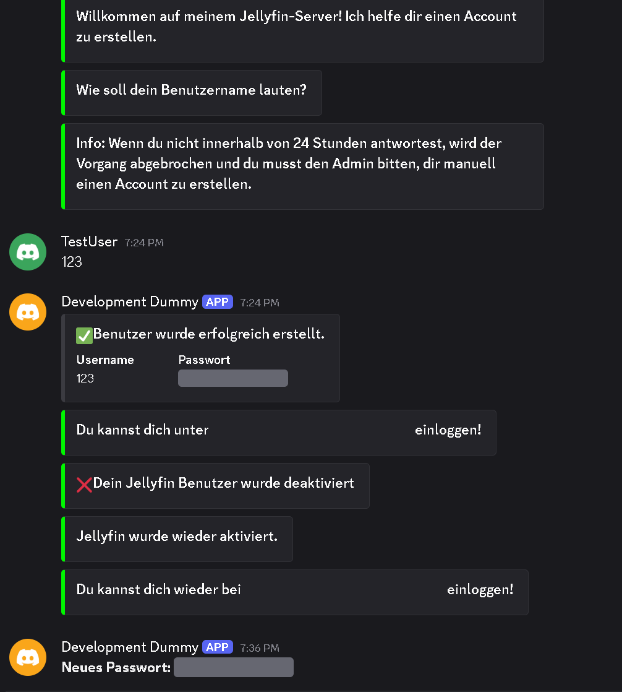

**still-Membarr** - 1.2
=================
is still a Membarr bot with small modifications it looks like Yurorio stopped work on it so i forked it<br>**the thanks definitely go to [Yurorio](https://github.com/Yoruio/Membarr)  and [faizyy01](https://github.com/faizyy01/Invitarr)**

My motivation to change the bot: <br>
· on the other hand I simply missed the "membership function" and the independent password reset without admin.<br>
· the annoying feature that people always have to create a new account after deactivation and thus of course the "seen tag" as well as the interests of the account owner, i.e. no suggestions that I might like<br>

<ins>My personaly use:</ins> <br>
[discord_subscription_bot](https://github.com/baervers23/discord_subscription_bot) like the brain <br>
[still-membarr](https://github.com/baervers23/still-Membarr) like a gateceeper <br>

i share the costs of the server with friends and on this way its definitly fair to all <br>

>  [!TIP]
>  When using Jellyfin & Jellyseer together, I recommend the following setting in Jellyseerr: <br>
>  deactivate Jellyseerr -> User -> Activate local login <br>
>  activate  Jellyseer -> User -> Activate Jellyfin Login <br>
>
>  Also on this way there arent 2 accounts, so it dont get complicated with resetted password <br>

>  [!TIP]
>  change URL in Jellyseerr and you got forwarded to discord when click on "forgot password" [Example](/img/Unbenannt.png)<br>
>  paste Discord Channel URL in Jellyseerr -> Settings -> Jellyfin -> forgot password URL  <br>

Modifications & Changes:<br>

<ins>Functional:</ins> <br>
  · When a user gets the role for the first time the bot create a jellyfin account like the original<br>
  · If the role get taken away the account will get disabled instead of deleted (keeps userdata like for example watched states)<br>
  · On reearning the role the user will become enabled again (no informations are gone so he still has the old password and permissions)<br>
  · delete account on loose role has been deactivated but its untouched (i just renamed the call function from delete to disable)<br>
<br>
<ins>Commands:</ins><br>
· added user command **/jellyfin resetpassword** (You will get a DM with a new randomly generated password if you forgot your old one)<br>
· added user command **/jellyfin refreshlibrary** (Initialize a manual full library scan in case of sonarr/radarr failed or whatever)<br>
· added admin command **/jellyfinsettings cooldownrefreshlib <minutes>** (Set the cooldown for user command refresh library to avoid spam)<br> 
<br>
<ins>Text/Language:</ins><br>
For my personal use i translated the text of the bot account creatiion/deactivation/reactivation part, i plan to retranslate it back for non german users <br>
<br>
<ins>Planned:</ins><br>
- [ ] Translate all the text back in english :tada:<br>
<br>



<br>
<br>
# ORIGINAL README BELOW<br>
Membarr <br>
=================<br>

Membarr is a fork of Invitarr that invites discord users to Plex and Jellyfin. You can also automate this bot to invite discord users to a media server once a certain role is given to a user or the user can also be added manually.  

### Features

- Ability to invite users to Plex and Jellyfin from discord 
- Fully automatic invites using roles 
- Ability to kick users from plex if they leave the discord server or if their role is taken away.
- Ability to view the database in discord and to edit it.

Commands: 

```
/plex invite <email>
This command is used to add an email to plex
/plex remove <email>
This command is used to remove an email from plex
/jellyfin invite <jellyfin username>
This command is used to add a user to Jellyfin.
/jellyfin remove <jellyfin username>
This command is used to remove a user from Jellyfin.
/membarr dbls
This command is used to list Membarr's database
/membarr dbadd <@user> <optional: plex email> <optional: jellyfin username>
This command is used to add exsisting  plex emails, jellyfin users and discord id to the DB.
/membarr dbrm <position>
This command is used to remove a record from the Db. Use /membarr dbls to determine record position. ex: /membarr dbrm 1
```

NEW Commands:

```
/jellyfin resetpassword 
This command randomly generate a new password and send it to you in a dm
```
# Creating Discord Bot
1. Create the discord server that your users will get member roles or use an existing discord that you can assign roles from
2. Log into https://discord.com/developers/applications and click 'New Application'
3. (Optional) Add a short description and an icon for the bot. Save changes.
4. Go to 'Bot' section in the side menu
5. Uncheck 'Public Bot' under Authorization Flow
6. Check all 3 boxes under Privileged Gateway Intents: Presence Intent, Server Members Intent, Message Content Intent. Save changes.
7. Copy the token under the username or reset it to copy. This is the token used in the docker image.
8. Go to 'OAuth2' section in the side menu, then 'URL Generator'
9. Under Scopes, check 'bot' and applications.commands
10. Copy the 'Generated URL' and paste into your browser and add it to your discord server from Step 1.
11. The bot will come online after the docker container is running with the correct Bot Token


# Unraid Installation
> For Manual an Docker setup, see below

1. Ensure you have the Community Applications plugin installed.
2. Inside the Community Applications app store, search for Membarr.
3. Click the Install Button.
4. Add discord bot token.
5. Click apply
6. Finish setting up using [Setup Commands](#after-bot-has-started)

# Manual Setup (For Docker, see below)

**1. Enter discord bot token in bot.env**

**2. Install requirements**

```
pip3 install -r requirements.txt 
```
**3. Start the bot**
```
python3 Run.py
```

# Docker Setup & Start
To run Membarr in Docker, run the following command, replacing [path to config] with the absolute path to your bot config folder:
```
docker run -d --restart unless-stopped --name membarr -v /[path to config]:/app/app/config -e "token=YOUR_DISCORD_TOKEN_HERE" yoruio/membarr:latest
```

# After bot has started 

# Plex Setup Commands: 

```
/plexsettings setup <username> <password> <server name>
This command is used to setup plex login. 
/plexsettings addrole <@role>
These role(s) will be used as the role(s) to automatically invite user to plex
/plexsettings removerole <@role>
This command is used to remove a role that is being used to automatically invite uses to plex
/plexsettings setuplibs <libraries>
This command is used to setup plex libraries. Default is set to all. Libraries is a comma separated list.
/plexsettings enable
This command enables the Plex integration (currently only enables auto-add / auto-remove)
/plexsettings disable
This command disables the Plex integration (currently only disables auto-add / auto-remove)
```

# Jellyfin Setup Commands:
```
/jellyfinsettings setup <server url> <api key> <optional: external server url (default: server url)>
This command is used to setup the Jellyfin server. The external server URL is the URL that is sent to users to log into your Jellyfin server.
/jellyfinsettings addrole <@role>
These role(s) will be used as the role(s) to automatically invite user to Jellyfin
/jellyfinsettings removerole <@role>
This command is used to remove a role that is being used to automatically invite uses to Jellyfin
/jellyfinsettings setuplibs <libraries>
This command is used to setup Jellyfin libraries. Default is set to all. Libraries is a comma separated list.
/jellyfinsettings enable
This command enables the Jellyfin integration (currently only enables auto-add / auto-remove)
/jellyfinsettings disable
This command disables the Jellyfin integration (currently only disables auto-add / auto-remove)
```

# Migration from Invitarr
Invitarr does not require the applications.commands scope, so you will need to kick and reinvite your Discord bot to your server, making sure to tick both the "bot" and "applications.commands" scopes in the Oauth URL generator.

Membarr uses a slightly different database table than Invitarr. Membarr will automatically update the Invitarr db table to the current Membarr table format, but the new table will no longer be compatible with Invitarr, so backup your app.db before running Membarr!

# Migration to Invitarr
As mentioned in [Migration from Invitarr](#Migration-From-Invitarr), Membarr has a slightly different db table than Invitarr. To Switch back to Invitarr, you will have to manually change the table format back. Open app.db in a sqlite cli tool or browser like DB Browser, then remove the "jellyfin_username" column, and make the "email" column non-nullable.

# Contributing
We appreciate any and all contributions made to the project, whether that be new features, bugfixes, or even fixed typos! If you would like to contribute to the project, simply fork the development branch, make your changes, and open a pull request. *Pull requests that are not based on the development branch will be rejected.*

# Other stuff
**Enable Intents else bot will not Dm users after they get the role.**
https://discordpy.readthedocs.io/en/latest/intents.html#privileged-intents
**Discord Bot requires Bot and application.commands permission to fully function.**
